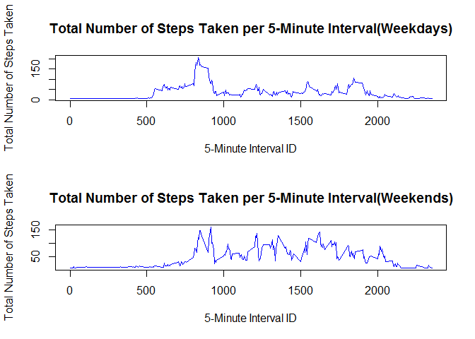

# Reproducible Research: Peer Assessment 1


### Part 1: What is The Mean Total Number of Steps Taken Per Day? 

*Loading data from activity.csv*


```r
## read the activity.csv file and then converts date into type date
activity <- read.csv("activity.csv")
activity$date <- as.Date(activity$date)
```

*Processing the data for analysis using melt and dcast from reshape2 package* 


```r
library(reshape2)
```

```
## Warning: package 'reshape2' was built under R version 3.2.5
```

```r
## Melt activity data frame, setting id variable to date and steps as the variable to be measured
meltedActivity <- melt(activity,id.vars="date",measure.vars="steps",na.rm=FALSE)

## cast the melted activity data frame to present a table that gives the total number of steps taken per day 
castedActivity <- dcast(meltedActivity,date~variable,sum)
```

*Plotting Histogram of Data*


```r
## Creates a histogram with frequency of steps per day and a blue trendline at the average number of steps per day
plot(x=castedActivity$date,y=castedActivity$steps,type="h",xlab="Date",ylab="Total Number of Steps Taken",main="Total Number of Steps Taken per Day",lwd=6)
abline(h=mean(castedActivity$steps,na.rm=TRUE),col="blue")
```

<!-- -->

*Reporting Mean and Median*


```r
meanSteps <- mean(castedActivity$steps,na.rm=TRUE)
medianSteps <- median(castedActivity$steps,na.rm=TRUE)
```

The mean number of steps taken per day is 1.0766189\times 10^{4}.

The median number of steps taken per day is 10765.  

### Part 2: What is the Average Daily Pattern?

*Re-Processing the data for analysis using melt and dcast from reshape2 package*


```r
## Re-Melt activity data frame, setting id variable to interval and steps as the variable to be measured
meltedIntActivity <- melt(activity, id.vars="interval", measure.vars="steps", na.rm=TRUE)

## Cast the meltedIntActivity data frame to find mean number of steps per interval
castedIntActivity <- dcast(meltedIntActivity, interval ~ variable, mean)
```

*Create a Time Series Plot to Find Average number of Steps per 5-Minute Interval*


```r
## Time Series Plot of 5 Minute Intervals
plot(x=castedIntActivity$interval,y=castedIntActivity$steps,type="l",xlab="5-Minute Interval ID",ylab="Total Number of Steps Taken",main="Total Number of Steps Taken per 5-Minute Interval")
## Draw Line of Average Number of Steps taken across Intervals
abline(h=mean(castedIntActivity$steps,na.rm=TRUE),col="blue")
```

<!-- -->

*Find the 5-Minute Interval with the Maximum Number of Steps*


```r
maxSteps <- max(castedIntActivity$steps)
maxInterval <- castedIntActivity$interval[which(castedIntActivity$steps == max(castedIntActivity$steps))]
```

The maximum number of steps in a single interval is 206.1698113.

The interval ID this occurs in is 835. 

### Part 3: Imputing Missing Values 

*Calculate the Number of Missing Values in the Dataset* 


```r
numMissing <- sum(is.na(activity$steps))
```

The number of missing values in the dataset is 2304

*Devise Strategy for filling in Missing Values* 

For this example, I will replace the NA values with the mean of the non-NA values within each interval. 

*Create new dataset with missing data filled in* 


```r
## Create new dataset where NAs will be replaced
imputedActivity <- activity 

## Merge our new activity data set with castedIntActivity, the steps per interval data set, 
actMerge = merge(imputedActivity, castedIntActivity, by="interval", suffixes=c(".act", ".spi"))

## List of indices with missing values
naIndex <- which(is.na(imputedActivity$steps))

## Replace NA values with value from steps.spi
imputedActivity[naIndex,"steps"] = actMerge[naIndex,"steps.spi"]
```

*Make a histogram of total steps per day with this new dataset* 


```r
## Melt the newly created dataset to prep it for casting
meltImputedActivity <- melt(imputedActivity, id.vars="date", measure.vars="steps", na.rm=FALSE) 

## Cast the melted dataset to get steps per day 
castImputedActivity <- dcast(meltImputedActivity, date ~ variable, sum)

## Plot Histogram that shows total steps per day as well as the average across days
plot(x=castImputedActivity$date,y=castImputedActivity$steps,type="h",xlab="Date",ylab="Total Number of Steps Taken",main="Total Number of Steps Taken per Day (With Imputed NA Values)",lwd=6)
abline(h=mean(castImputedActivity$steps,na.rm=TRUE),col="blue")
```

<!-- -->

*Calculate the mean and median total number of steps taken per day* 


```r
imputedMean <- mean(castImputedActivity$steps,na.rm=TRUE)
imputedMedian <- median(castImputedActivity$steps,na.rm=TRUE)
```

The imputed mean number of steps taken per day is 1.0889799\times 10^{4}.

The imputed median number of steps taken per day is 1.1015\times 10^{4}. 

Note that before the missing values were removed, the mean number of steps per day was reported as **10,766.19** steps with a median of **10,765** steps while after the NA values were imputed, the mean number of steps per day was reported as **10,889.80** steps with a median of **11,015** steps. As such, the reported mean value of steps increased by a little over 1% and the reported median value of steps increased by a little over 2%.   

### Part 4: Are there differences in activity patterns between weekdays and weekends?

*Create new factor variable that says whether day is a weekday or a weekend* 


```r
## Use a for-loop to create this new factor variable
for (i in 1:nrow(imputedActivity)) {
    if (weekdays(imputedActivity$date[i]) == "Saturday" | weekdays(imputedActivity$date[i]) == "Sunday") {
        imputedActivity$dayOfWeek[i] = "weekend"
    } else {
        imputedActivity$dayOfWeek[i] = "weekday"
    }
}
```

*Create panel plot comparing Interval ACtivity on Weekdays vs. Weekends* 


```r
## Subset the imputed activity by weekday or weekend 
weekdayActivity <- subset(imputedActivity, dayOfWeek=="weekday")
weekendActivity <- subset(imputedActivity, dayOfWeek=="weekend")

## Use melt and cast to preprocess the new subsets
meltWeekday <- melt(weekdayActivity, id.vars="interval", measure.vars="steps")
meltWeekend <- melt(weekendActivity, id.vars="interval", measure.vars="steps")
castWeekday <- dcast(meltWeekday, interval ~ variable, mean)
castWeekend <- dcast(meltWeekend, interval ~ variable, mean)

## Plot weekday vs. weekend data
par(mfrow=c(2,1))
plot(x=castWeekday$interval,y=castWeekday$steps,type="l",xlab="5-Minute Interval ID",ylab="Total Number of Steps Taken",main="Total Number of Steps Taken per 5-Minute Interval(Weekdays)",col="blue")
plot(x=castWeekend$interval,y=castWeekend$steps,type="l",xlab="5-Minute Interval ID",ylab="Total Number of Steps Taken",main="Total Number of Steps Taken per 5-Minute Interval(Weekends)",col="blue")
```

<!-- -->

